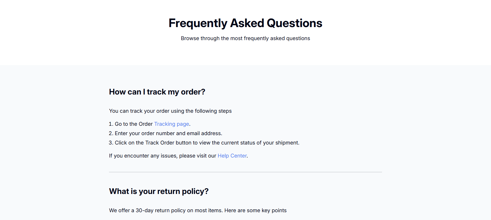

<!-- Please update value in the {}  -->

<h1 align="center">Simple FAQ | devChallenges</h1>

   Solution for a challenge <a href="https://devchallenges.io/challenge/simple-faq-challenge" target="_blank">Simple FAQ</a> from <a href="http://devchallenges.io" target="_blank">devChallenges.io</a>.

  <h3>
    <a href="https://codebyev.github.io/simple-faq/">
      Demo
    </a>
     | 
    <a href="https://devchallenges.io/challenge/simple-faq-challenge">
      Challenge
    </a>
  </h3>

<!-- OVERVIEW -->

## Overview

Small challenge by devchallenges.io to create simple FAQ page.

